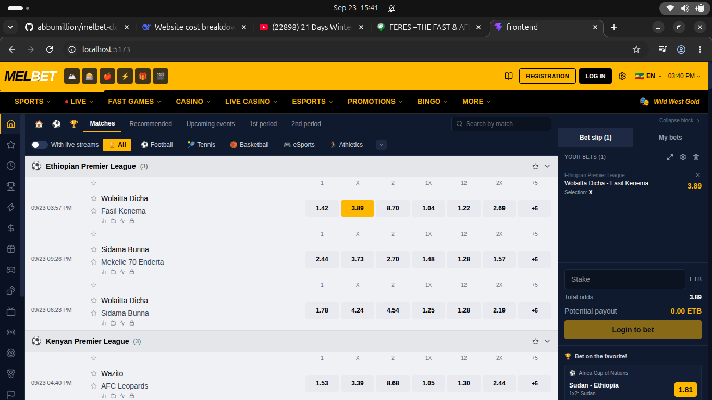

# Melbet Clone — Live Sports Betting Demo

A full-stack clone of a modern sportsbook, built with **Spring Boot 4**, **React 19**, **PostgreSQL**, and **Redis**. Features JWT authentication, OTP email verification, and a real-time match simulation engine covering football, basketball, tennis, athletics, and eSports.

> ⚠️ **Disclaimer:** This is a learning and portfolio project only. No real bets are accepted, and all match data is simulated.

## ✨ Features

**Authentication**
- Email + password registration
- 6-digit OTP verification (Redis-backed, 15-min expiry)
- JWT tokens with 24-hour expiry
- Spring Security filter chain

**Live Match Engine**
- 40+ simulated matches across 5 sports
- Ticks every 10 seconds — scores, minutes, and odds update live
- Sport-specific logic (football minutes, basketball quarters, tennis sets)
- Realistic odds with bookmaker overround

**Frontend**
- Melbet-inspired UI (yellow header, dark nav, light match rows)
- Sport-adaptive columns
- Bet slip with stake input and payout math
- Responsive: mobile card layout, desktop grid layout

## 🛠️ Tech Stack

**Backend:** Java 21 · Spring Boot 4.1 · Spring Security 7 · Spring Data JPA · PostgreSQL 16 · Redis 7 · JJWT · Maven

**Frontend:** React 19 · Vite · Tailwind CSS 4 · React Router 7 · Axios · Lucide

**Infra:** Docker Compose

## 🚀 Getting Started

**Prerequisites:** Java 21+, Node.js 20+, Docker

```bash
# 1. Start infrastructure
docker compose up -d

# 2. Run backend
cd backend && ./mvnw spring-boot:run

# 3. Run frontend (new terminal)
cd frontend && npm install && npm run dev
